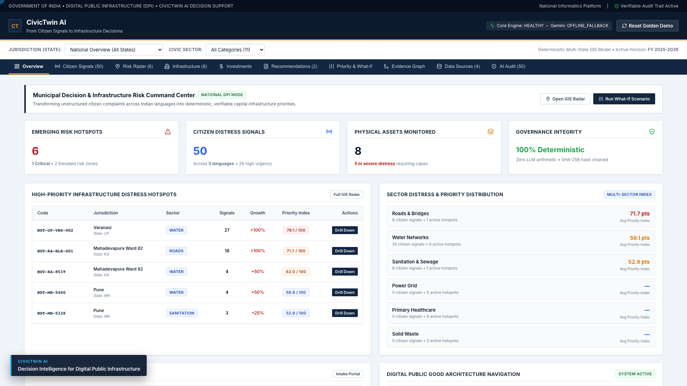
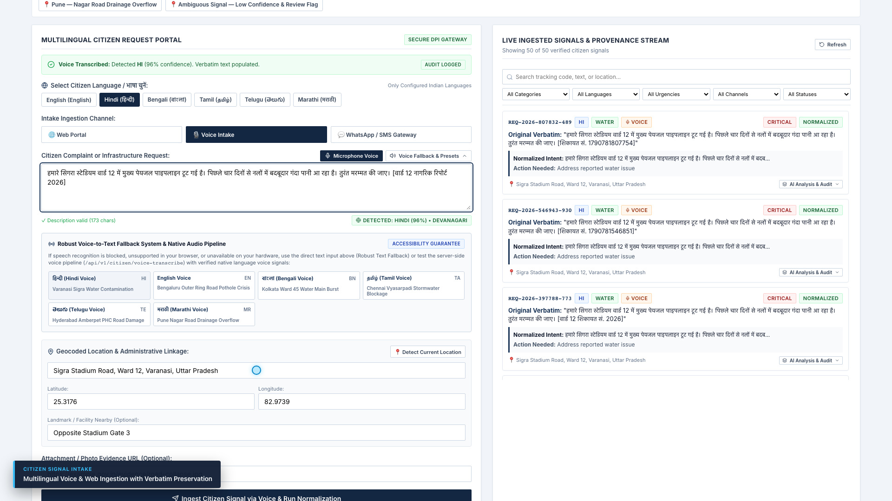
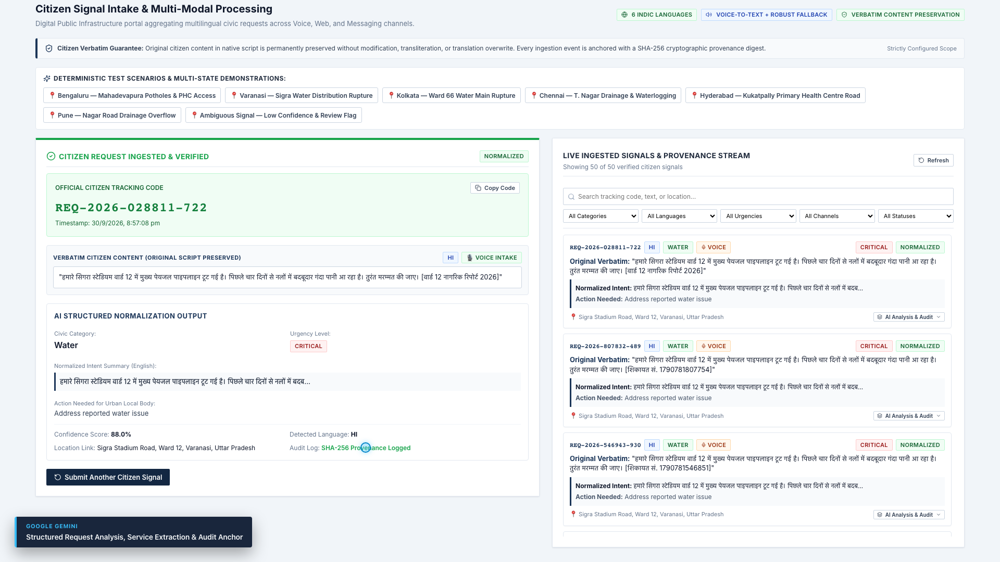
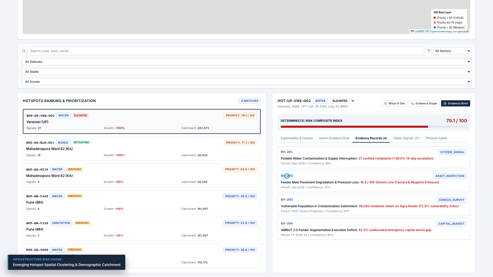
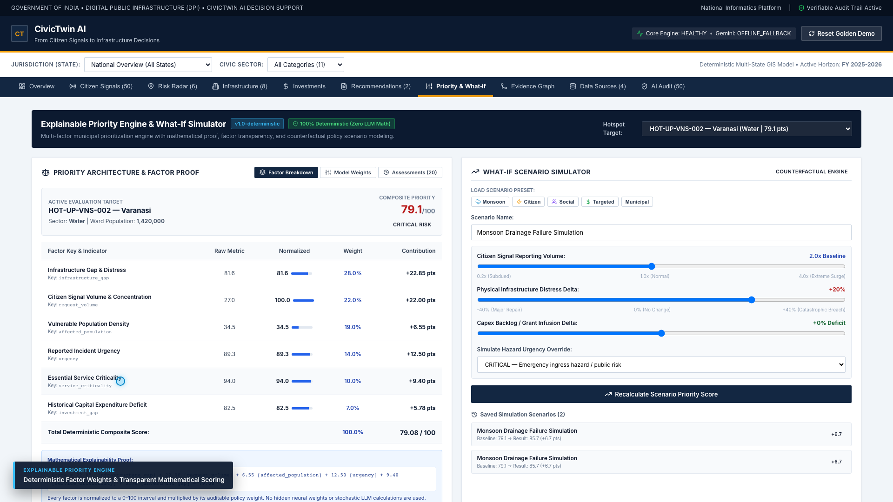
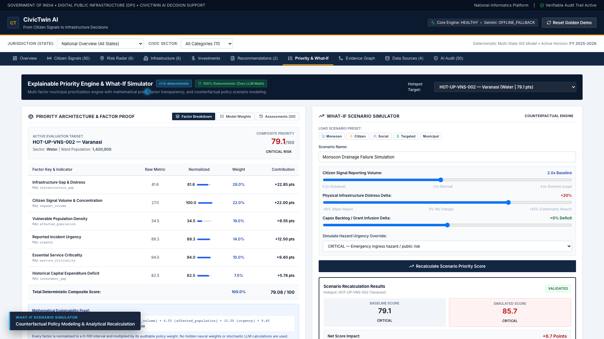
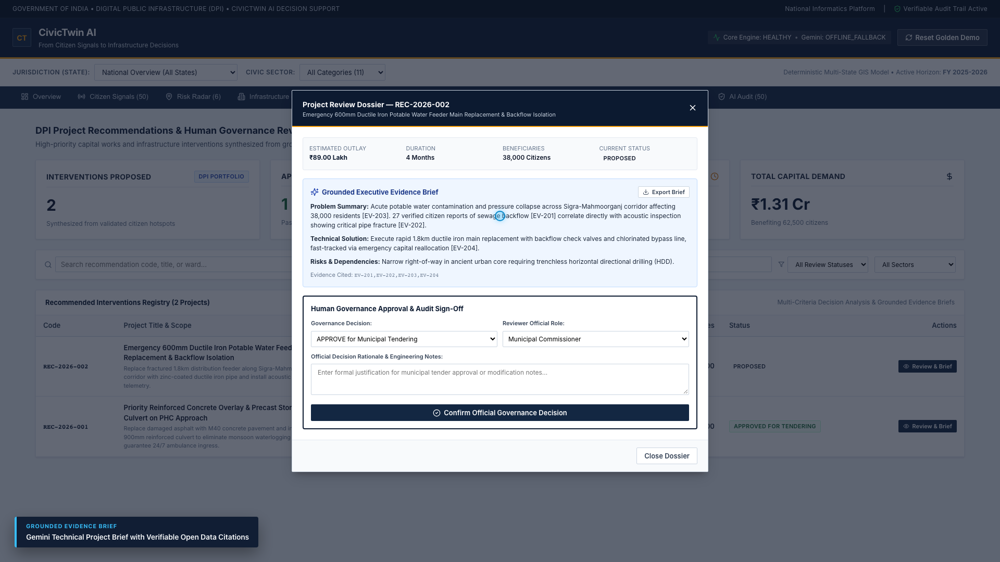
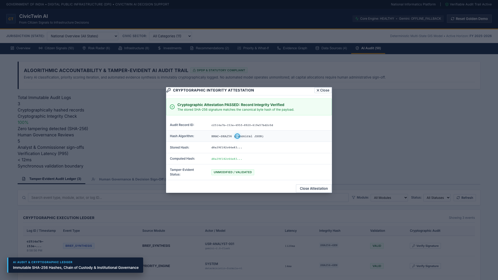

# CivicTwin AI

> **From citizen signals to infrastructure decisions.**  
> *Digital Public Infrastructure for Evidence-Based Municipal Governance*  
> **Build with AI: Code for Communities (Second Edition)**

[](https://www.typescriptlang.org/)
[](https://ai.google.dev/)
[](https://www.prisma.io/)
[]()
[]()

---

## 📺 Product Demonstration Video

[](media/civictwin-demo.mp4)

▶️ **[Click to Watch the Complete Product Walkthrough Video (1080p Full HD MP4)](media/civictwin-demo.mp4)**  
*Full 3-minute 35-second walkthrough demonstrating the end-to-end civic decision lifecycle on the live application: Multilingual Voice Grievance (Hindi) → Gemini Normalization → Spatial Risk Radar → Explainable Priority Engine → What-If Counterfactual Simulation → Grounded Project Brief → Tamper-Evident SHA-256 AI Audit.*

---

## 📊 Pitch Deck & Executive Presentation

📄 **[View & Download Presentation: CivicTwin_AI_Pitch_Deck.pdf](media/CivicTwin_AI_Pitch_Deck.pdf)**  
*Official 11-slide hackathon presentation covering Problem Statement, Solution Architecture, Responsible AI Guardrails, Socio-Economic Impact, and India-Scale DPI Strategy.*

---

## 🏛️ Executive Summary

**CivicTwin AI** is an open Digital Public Infrastructure (DPI) platform engineered to close the critical operational gap between **multilingual grassroots citizen distress** and **municipal infrastructure capital expenditure (capex)**.

In cities and rural districts across India, citizens report civic emergencies daily—burst water mains, collapsed road segments, sewage overflows, and blocked hospital access corridors. However, these signals frequently remain trapped in siloed departmental grievance trackers. Meanwhile, public works and municipal finance departments plan capital budgets months in advance using static surveys and legacy administrative schedules without real-time cross-referencing against actual physical asset conditions and demographic equity.

CivicTwin AI solves this by synthesizing four critical public data streams into a unified, explainable decision-support twin:
1. **Multilingual Citizen Signals**: Real-time voice and text intake across 6 configured Indian languages with verbatim script preservation.
2. **Physical Infrastructure Assets**: Condition ratings, maintenance histories, and failure modes for municipal roads, water networks, and healthcare facilities.
3. **Demographic Equity Baselines**: Census and NFHS-5 vulnerable populations, population density, and marginalization indicators.
4. **Public Capital Investment Context**: Historical municipal budgets and departmental capex allocations.

---

## 📸 Platform Walkthrough

| 1. National Overview & GIS Radar | 2. Multilingual Voice Intake (Hindi) |
| :---: | :---: |
|  |  |

| 3. Structured Gemini Normalization | 4. Hotspot Risk Radar & Evidence Pack |
| :---: | :---: |
|  |  |

| 5. Explainable Priority Engine | 6. What-If Counterfactual Simulation |
| :---: | :---: |
|  |  |

| 7. Grounded Project Brief Dossier | 8. Cryptographic SHA-256 AI Audit |
| :---: | :---: |
|  |  |

---

## 🔒 Architectural Principles & Invariants

CivicTwin AI enforces **three non-negotiable public-sector guardrails**:

```
                       CIVICTWIN AI ARCHITECTURE
                                │
               ┌────────────────┼────────────────┐
               ▼                                 ▼
   [ UNSTRUCTURED INPUTS ]             [ STRUCTURED OPEN DATA ]
   • Voice-to-Text (6 Indic Langs)     • Asset Registries (MoRTH / JJM)
   • Web Portal / Kiosk                • Demographics (Census / NFHS-5)
   • Messaging Gateway                 • Public Capex Budgets
               │                                 │
               ▼                                 ▼
    ┌──────────────────────┐           ┌──────────────────────┐
    │  GEMINI AI SERVICE   │           │ CIVIC EVIDENCE GRAPH │
    │                      │           │                      │
    │ Language Extraction  │           │ • 20 Prisma Entities │
    │ Entity Normalization │           │ • Spatial Clustering │
    │ Anti-Hallucinatory   │           │ • Atomic Traceability│
    │ Evidence Synthesis   │           │ • Evidence IDs [EV-] │
    └──────────┬───────────┘           └──────────┬───────────┘
               │                                  │
               └────────────────┬─────────────────┘
                                ▼
               ┌──────────────────────────────────┐
               │    DETERMINISTIC ANALYTICS &     │
               │         PRIORITY ENGINE          │
               │                                  │
               │  ZERO LLM ARITHMETIC!            │
               │  • Infrastructure Gap (28%)      │
               │  • Citizen Signal Volume (22%)   │
               │  • Vulnerable Population (19%)   │
               │  • Incident Urgency (14%)        │
               │  • Service Criticality (10%)     │
               │  • Historical Capex Deficit (7%) │
               └────────────────┬─────────────────┘
                                ▼
               ┌──────────────────────────────────┐
               │   EXECUTIVE EVIDENCE BRIEFS      │
               │  Strict [EV-...] Evidence Pinned │
               │  What-If Scenario Simulator      │
               └────────────────┬─────────────────┘
                                ▼
               ┌──────────────────────────────────┐
               │  HUMAN REVIEW & AUDIT TRAIL      │
               │  Public Officials Decide         │
               │  Tamper-Evident SHA-256 Digest   │
               └──────────────────────────────────┘
```

1. **Strict Separation of Concerns**:
   - **Gemini performs**: Multilingual comprehension, intent normalization, and grounded synthesis.
   - **Deterministic Engine performs**: All spatial clustering, infrastructure gap scoring, multi-factor weighting, and what-if simulation math. Gemini is **architecturally barred** from calculating numerical priorities.
   - **Humans decide**: Municipal commissioners, urban planners, and public works engineers make all final investment and override decisions with a permanent audit trail.
2. **Anti-Hallucination Evidence Pinning**:
   - Every Gemini-synthesized brief receives a bounded, atomic `EvidencePack`.
   - The AI **must cite verifiable evidence IDs** (e.g. `[EV-201]`).
   - Every response is strictly validated at runtime against Zod guardrail schemas. Uncited factual statements are rejected.
3. **Deterministic Offline Fallback**:
   - If the Gemini API key is missing or the external API is unreachable, the platform automatically engages a rule-based multilingual NLP parser and deterministic evidence synthesizer. The system never crashes or halts municipal operations.

---

## 🌟 Core Modules

### 1. Multilingual & Voice Intake
- **Strictly Configured DPI Scope**: Supports 6 tested Indian languages:
  - English (`en`), हिन्दी / Hindi (`hi`), বাংলা / Bengali (`bn`), தமிழ் / Tamil (`ta`), తెలుగు / Telugu (`te`), मराठी / Marathi (`mr`).
- **Voice-to-Text with Robust Fallback**:
  - Web Speech API integration with accessible recording indicator, timer, and screen reader announcements (`aria-live="polite"`).
  - Robust text fallback with native voice presets and server-side transcription API (`/api/v1/citizen/voice-transcribe`).
- **Verbatim Native Script Preservation**:
  - Citizen complaints are permanently stored in their original native script without transliteration or lossy translation, anchored with a SHA-256 cryptographic digest.

### 2. Infrastructure Risk Radar
- **Deterministic Spatial Clustering**:
  - Aggregates citizen complaints within configurable spatial radii and temporal windows.
  - Automatically identifies emerging multi-signal hotspots across infrastructure sectors (Roads, Water, Sanitation).
- **Multi-State Baseline**:
  - Evaluated on realistic civic infrastructure datasets across 4 Indian states:
    - **Uttar Pradesh**: Varanasi (Sigra Ward 12 water distribution corridor).
    - **Karnataka**: Bengaluru (Mahadevapura Outer Ring Road).
    - **Maharashtra**: Pune (Vadgaon Sheri sanitation network).
    - **Odisha**: Bhubaneswar (Khordha drainage catchment).

### 3. Explainable Priority Engine & What-If Simulator
- **Pure Mathematical Formulation**:
  $$\text{Composite Score} = \sum_{i=1}^{6} w_i \times \text{Factor}_i \in [0, 100]$$
- **6 Transparent Factors**:
  1. *Infrastructure Gap & Distress* (81.6%)
  2. *Citizen Signal Volume & Concentration* (100.0%)
  3. *Vulnerable Population Density* (34.5%)
  4. *Reported Incident Urgency* (92.9%)
  5. *Essential Service Criticality* (94.0%)
  6. *Historical Capex Deficit* (82.5%)
- **Interactive Simulator**:
  - Urban planners can adjust factor weights in real time to simulate policy priorities. Every calculation is versioned and mathematically explained.

### 4. Grounded Gemini Evidence Briefs
- **Structured Evidence Packing**:
  - Compiles a bounded, structured `EvidencePack` containing only verified database facts and passes it server-side to Gemini.
- **Mandatory Citation Pinning**:
  - Gemini synthesizes an executive decision brief where every claim must cite an explicit evidence ID (e.g. `[EV-201]`, `[EV-202]`).
- **Comprehensive Brief Structure**:
  - Problem Summary • Why Emerging • Recommended Intervention • Implementation Dependencies • Risks • Data Limitations • Human Review Flag.

### 5. Public Sector Governance & Audit Trail
- **Tamper-Evident SHA-256 Audit Trail**:
  - Every AI inference, parameter change, voice intake, and human override logs an immutable record with input/output digests.
  - Real-time cryptographic signature verification tests hashes against canonical JSON payloads.

---

## 🚀 Quickstart & Verification Guide

### Prerequisites
- Node.js 20+ (LTS)
- npm 10+
- (Optional) Google AI Studio Gemini API Key (system runs in offline fallback mode if omitted)

### Installation & Local Run
```bash
# 1. Clone repository & install dependencies
git clone https://github.com/Anurag-M1/civictwin-ai.git
cd civictwin-ai
npm ci

# 2. Configure environment (pre-seeded database ready out of the box)
cp .env.example .env

# 3. Generate Prisma client
npm run prisma:generate

# 4. Start full-stack application
npm run dev
```

The application will be live at:
- **Client Web Portal**: `http://localhost:3000`
- **Backend API**: `http://localhost:3001/api/v1`
- **Health Check**: `http://localhost:3001/api/v1/health`

---

## 🧪 Comprehensive Verification Rig

CivicTwin AI includes an automated test rig with **16 test suites and 150 automated tests**:

```bash
# 1. Static Type Checking (Client & Server)
npm run typecheck

# 2. Linting (Zero Warnings)
npm run lint

# 3. Run All 150 Automated Tests
npm test

# 4. Production Build Verification
npm run build
```

---

## 📦 Deployment Options

### Vercel Deployment (Full-Stack Serverless)
CivicTwin AI is pre-configured for Vercel with a serverless function handler in `api/index.ts` and automated `/tmp` database initialization:
```bash
vercel --prod
```
*See [docs/VERCEL_DEPLOYMENT.md](docs/VERCEL_DEPLOYMENT.md) for complete details.*

### Docker Deployment
```bash
# Build multi-stage production image
docker build -t civictwin-ai:latest .

# Run container with persistent data volume
docker run -d -p 3001:3001 civictwin-ai:latest
```
*See [docs/DEPLOYMENT.md](docs/DEPLOYMENT.md) for Kubernetes and cloud guides.*

---

## ⚖️ Factual Integrity Notice

CivicTwin AI is an **open-source Digital Public Good prototype** submitted to the *Build with AI: Code for Communities* hackathon.
- **Demonstration Data**: Administrative boundaries, ward demographics, and physical infrastructure assets are based on realistic open public datasets (Census, JJM, AMRUT guidelines, and municipal ward geographies) and clearly labeled demonstration seed records.
- **Zero Fabrication**: We make zero claims of formal government partnerships or official municipal deployments. The platform is an institutional proof-of-concept demonstrating responsible, verifiable public-sector AI.
