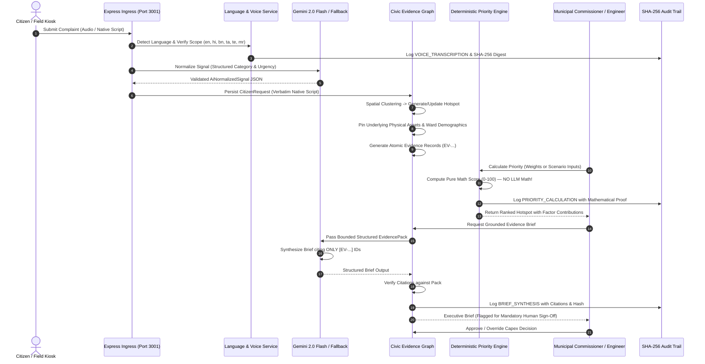

# CivicTwin AI — System Architecture & Data Flow

> **Domain**: Digital Public Infrastructure (DPI) & Public Sector Civic Decision Support  
> **Platform**: CivicTwin AI  
> **Standards Compliance**: Open Digital Public Good (DPG) Guidelines, Public Sector Audit Integrity  
> **Standalone Visual Diagram**: [Open Interactive Architecture Diagram](ARCHITECTURE_DIAGRAM.html)

---

## 1. High-Level System Architecture

```mermaid
graph TD
    classDef client fill:#f8fafc,stroke:#334155,stroke-width:1px,color:#0f172a;
    classDef gateway fill:#eff6ff,stroke:#1e40af,stroke-width:2px,color:#1e293b;
    classDef core fill:#f0fdf4,stroke:#16a34a,stroke-width:2px,color:#0f172a;
    classDef ai fill:#fff7ed,stroke:#ea580c,stroke-width:2px,color:#7c2d12;
    classDef persist fill:#f5f3ff,stroke:#7c3aed,stroke-width:2px,color:#2e1065;
    classDef audit fill:#fef2f2,stroke:#dc2626,stroke-width:2px,color:#7f1d1d;

    subgraph CLIENT_LAYER["1. CLIENT & CHANNELS"]
        WEB["Web Portal (React + Vite + Leaflet GIS)"]:::client
        VOICE_INTAKE["Voice Intake (Web Speech API / Audio Recording)"]:::client
        MESSAGING["Messaging / Kiosk Signal Presets"]:::client
    end

    subgraph INGRESS_LAYER["2. INGRESS & SECURITY GATEWAY"]
        HELMET["Helmet Security Headers"]:::gateway
        RATE_LIMITER["DPI Token-Bucket Rate Limiter (300 req/min)"]:::gateway
        REQ_CONTEXT["Correlation ID (X-Request-Id) & Access Logger"]:::gateway
        AUTH_BOUNDARY["Public Intake / Protected Official Boundary"]:::gateway
    end

    subgraph CORE_SERVICES["3. APPLICATION & DOMAIN SERVICES"]
        LANG_SRV["Language Detection Service (en, hi, bn, ta, te, mr)"]:::core
        VOICE_SRV["Voice Transcription Service (MIME check & Audio Fallback)"]:::core
        RADAR_SRV["Risk Radar & Spatial Clustering Service (DBSCAN / Grid)"]:::core
        PRIORITY_SRV["Deterministic Priority Engine (Zero AI Math, Versioned)"]:::core
        SIMULATOR_SRV["What-If Scenario Simulator (Factor Weights)"]:::core
        GRAPH_SRV["Civic Evidence Graph Service (EV-... Evidence Linking)"]:::core
    end

    subgraph AI_LAYER["4. GEMINI INTELLIGENCE LAYER"]
        GEMINI_EXTRACT["Structured Citizen Signal Normalizer"]:::ai
        GEMINI_BRIEF["Grounded Evidence Brief Synthesizer"]:::ai
        ZOD_GUARDRAILS["Zod Runtime Output Validation Guardrails"]:::ai
        DETERMINISTIC_FALLBACK["Rule-Based Offline NLP & Synthesis Fallback"]:::ai
    end

    subgraph PERSISTENCE["5. PERSISTENCE LAYER (PRISMA ORM)"]
        DB_CITIZEN["CitizenRequest (Verbatim Script)"]:::persist
        DB_HOTSPOT["Hotspot & IssueCluster"]:::persist
        DB_ASSETS["InfrastructureAsset & MaintenanceLog"]:::persist
        DB_AREAS["AdministrativeArea & Demographics"]:::persist
        DB_INVESTMENTS["PublicInvestment & CapexAllocation"]:::persist
        DB_EVIDENCE["EvidenceRecord (Atomic Units EV-...)"]:::persist
        DB_BRIEFS["EvidenceBrief & Recommendation"]:::persist
    end

    subgraph AUDIT_LAYER["6. TAMPER-EVIDENT AUDIT TRAIL"]
        SHA256_ENGINE["SHA-256 Digest Calculation Engine"]:::audit
        AUDIT_LOG["AuditEvent Table (Input/Output Digests, Module, User)"]:::audit
    end

    %% Wiring
    CLIENT_LAYER --> INGRESS_LAYER
    INGRESS_LAYER --> CORE_SERVICES
    CORE_SERVICES <--> AI_LAYER
    CORE_SERVICES <--> PERSISTENCE
    CORE_SERVICES --> AUDIT_LAYER
    AI_LAYER --> AUDIT_LAYER
```



---

## 2. End-to-End Data Flow Sequence



---

## 3. Evidence ID Schema & Atomic Tracing Taxonomy

Every analytical statement in CivicTwin AI is bound to an atomic evidence identifier conforming to the public sector provenance schema:

```
+--------------------------------------------------------------------------+
| Evidence ID: EV-[STATE]-[ENTITY]-[SEQ]                                   |
| Example:     EV-KA-CITIZEN-00142                                         |
+--------------------------------------------------------------------------+
| Category:       CITIZEN_SIGNALS                                          |
| Source Entity:  CitizenRequest (REQ-2026-005220-184)                     |
| Verbatim Text:  "वाराणसी सिगरा में पानी की पाइपलाइन क्षतिग्रस्त है।"    |
| Language:       Hindi (hi) • Devanagari Script                           |
| Channel:        VOICE (Web Speech Stream)                                |
| Geocode:        Lat: 25.3176, Lng: 82.9739 (Sigra, Varanasi, UP)        |
| Physical Asset: ASSET-UP-VNS-WTR-001 (Sigra Water Transmission Main)     |
| Ward Census:    Varanasi Ward 12 (NFHS-5 Vulnerability Index: 0.64)      |
| Capex Gap:      ₹45,00,000 Unfunded Pipe Replacement (ULB FY25-26)       |
| Ingestion Hash: e3b0c44298fc1c149afbf4c8996fb92427ae41e4649b934ca495...  |
+--------------------------------------------------------------------------+
```

---

## 4. Architectural Invariants

1. **Strict Language Scope**:
   - Only configured and tested Indian languages (`en`, `hi`, `bn`, `ta`, `te`, `mr`) are processed. Non-supported scripts (e.g. Cyrillic, Arabic, CJK) are strictly flagged as unsupported without making false capability claims.
2. **Zero AI Arithmetic**:
   - Priority calculations ($0 \le S \le 100$) are 100% deterministic and reproducible. Gemini is never used for arithmetic calculations, preventing floating point hallucinations in capital budget allocations.
3. **Anti-Hallucinatory Grounding**:
   - Evidence briefs must cite atomic evidence records. Uncited factual claims fail automated validation.
4. **Mandatory Human-in-the-Loop**:
   - Statutory municipal capital decisions require municipal commissioner verification and sign-off. AI serves exclusively as a decision-support copilot.
